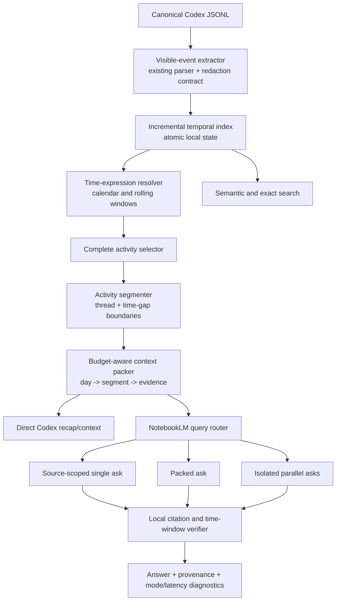

# Temporal Memory and Parallel NotebookLM Certification Plan

Status: certification program in progress (deterministic local release lane complete; live development retrieval gate failed and requires a development-only experiment; REL-002 active; concurrency/soak gates remain open)

Created: 2026-08-14

Scope: deterministic temporal memory, context preparation, NotebookLM-assisted synthesis, safe query fan-out, one-command usability, efficiency, validation, rollout, and maintenance.

## 1. Mission

Build a clean, local-authority temporal memory layer over Codex tasks so a fresh Codex task can reliably answer questions such as:

- What did I do yesterday?
- What was I working on last week?
- When did I request a particular refactor?
- What changed between Tuesday and Wednesday?
- What did I finish, leave unresolved, or revisit during a period?
- Load enough context from that period for us to continue the work now.

The same system must retain the existing semantic task-finding capability and add an evidence-gated route for asking multiple NotebookLM questions concurrently or in packed form. Faster execution is accepted only when it preserves source identity, citation alignment, answer quality, conversation isolation, account health, and local verification.

### Current evidence snapshot — 2026-08-14

This is the starting point for the remaining work, not a certification claim:

- The latest full repository gate is green at 48 Node tests and 213 Python tests, with compilation, PowerShell parsing, runner, doctor, auth/ACL, install, configuration, and scheduler integration checks passing.
- Versioned local-certification packets retain 101 focused aggregate-only cases, including temporal edge cases, context/UX contracts, cross-runtime redaction, recovery, and current-corpus performance. The 133-row matrix currently records 117 `pass`, 8 `covered`, 8 `pending`, and zero `fail` or `blocked` rows. Covered rows remain distinct from retained passes; release is still open.
- The live temporal index contains 16,597 events and zero quarantines at the latest doctor verification, with 145 path-free thread metadata records. Current source-map verification covers 145 requested threads across 147 ready source parts with no missing, mismatched, stale, or untracked source findings.
- The timing-only post-boundary monitor has 10 eligible runs and about 2.249 observed hours; the resource-aware retrieval monitor now has 11 eligible post-install runs, 2.492 observed hours, zero failures, and zero missing-resource reports. The 168-hour soak gate is open.
- NotebookLM transport and source-scope checks have passed in the canary lane, but the local claim verifier intentionally promoted zero of four remote answers because citation evidence did not match. Simulated remote outage, expired-auth, HTTP 429/503, and timeout paths now return locally verified fallback candidates. Local evidence remains authoritative.
- A frozen live 40-case development run on the disposable retrieval notebook recorded raw semantic candidate recall 31/32, raw Top-1 28/32, and 8/8 negative false positives. Candidate-only local reranking recovered 31/32 hybrid Top-1 and 0/8 false positives, which remains below the required 100% candidate-recall and 97.5% hybrid gates. A local-candidate union reached 32/32 combined coverage but degraded hybrid Top-1 to 30/32; no union policy was promoted.
- A bounded development-only minimum-four-candidate experiment completed 40/40 cases but reached only 30/32 candidate recall and 30/32 hybrid Top-1 with a slower latency tail. The default minimum remains two; this result is negative experiment evidence only.
- A fresh default-policy live run completed 40/40 cases but reached 30/32 semantic candidate recall, 26/32 raw citation-order Top-1, and 30/32 hybrid Top-1 with 0/8 hybrid false positives; the development gate remains failed.
- A local-only full-depth benchmark over the 145-thread projection reached 32/32 positive candidate coverage with zero errors, but the hardest expected match ranked 78. This supports testing local-first/source-scoped selection as a separately scored route; it does not prove Top-1 quality or justify changing the default.
- A sequential local-first/source-scoped canary using the top 80 local threads passed 32/32 hybrid Top-1 and 0/8 hybrid false positives with zero scope violations, but had a 249-second maximum latency; it is one development pass and still needs bounded-time implementation, repeated frozen runs, and holdout proof.
- A separate max-three-attempt experiment was stopped at its 30-minute process budget after 18/40 cases. It produced no release score; its observed latency is sufficient to reject a third remote attempt as the default UX, while retaining it as a future explicitly high-confidence experiment only.
- A negative-case audit rejected automatic local recovery after a remote/local-verification abstention because it surfaced weak candidates for all eight negative cases. The safe contract now fails closed for unverified remote results and keeps local fallback only for remote failure or no-candidate paths.
- A source-scoped R&D probe on one known development miss found the expected task at citation rank 7 with five locally selected sources and rank 2 with two sources; neither was Top-1, and latency was about 65–87 seconds. Source scoping remains synthesis-only until a broader frozen experiment proves value.
- Same-notebook fan-out is rejected as unsafe. No isolated notebook replicas have been created. Replica concurrency remains explicitly approval-gated.
- The approval-gated `notebooklm_isolated_ramp.py` harness now provides a dry-run capacity plan and a reversible live boundary; it has not been used to create replicas or promote a concurrency result.
- Temporal context packs now carry conservative heuristic signals with event-level provenance and support exact path-free project filtering; missing project metadata fails closed. Schema v1 migration, overlapping-refresh serialization, and verified paired rollback are covered by retained tests.

The working tree is therefore treated as an active development state, not a releasable state.

## 2. Honest definition of certified

No finite software process can prove that unknown bugs do not exist. For this project, **certified** means all of the following are simultaneously true:

1. Zero known P0, P1, or P2 defects remain open.
2. Zero required automated, replay, live, performance, security, or soak gates are failing or waived.
3. Every modeled use case and edge-case class in `certification-matrix.md` has an executable test or an explicitly justified manual inspection.
4. Exact temporal selection matches an independently generated oracle with no missing or out-of-window message identities.
5. Every generated factual claim can be traced to local task/message evidence; NotebookLM prose is never the sole authority.
6. Repeated frozen evaluations pass without tuning on sealed holdout details.
7. Crash recovery, index rebuilding, schema migration, auth failure, upstream failure, and rollback are proven.
8. The installed skill works from a fresh, context-free Codex task using the documented primary command surface.
9. Operational state is observable and bounded; background work does not produce windows, runaway processes, unbounded logs, silent retries, or hidden failures.
10. Residual risks—especially the unofficial NotebookLM interface—are recorded in the release certificate rather than hidden.

Any change after certification invalidates the affected evidence and reruns the relevant gates.

## 3. Non-negotiable architecture principles

1. **Local authority:** Codex JSONL/task data remains canonical for message identity, content, timestamps, and provenance.
2. **Message-level time:** Date membership is determined from each message timestamp, never only from thread creation or update time.
3. **UTC storage, local interpretation:** Store authoritative instants in UTC. Resolve calendar phrases using an explicit IANA time zone and DST-safe half-open ranges `[start, end)`.
4. **Exact before semantic:** Enumerate the complete temporal window first. Semantic ranking may filter or prioritize only after completeness is known.
5. **No duplicate timeline corpus by default:** Day/week/month are query views. Do not copy every transcript into daily and weekly NotebookLM sources unless a controlled experiment proves a material benefit.
6. **Stable provenance:** Every activity unit carries thread ID, role, timestamp, source line/event identity, and content digest.
7. **One parser contract:** Reuse the existing visible-message, compaction-exclusion, truncation, and redaction rules. Do not create divergent Node/Python interpretations.
8. **Idempotent and incremental:** Re-indexing unchanged input is a no-op. Partial writes and interrupted runs cannot corrupt the last good index.
9. **Conversation isolation:** Persistent human chat, disposable retrieval, benchmarks, and concurrency experiments remain distinct modes.
10. **Fail closed:** Missing timestamps, corrupt state, citation mismatch, source drift, unsafe conversation state, or uncertain identity produces an explicit degraded/abstain result.
11. **One primary UX:** A fresh Codex task should use one lifecycle CLI/skill contract rather than memorizing low-level scripts.
12. **Measured parallelism:** Concurrency ramps through 1, 2, 4, 8, and only later 16/32/50 if quality and account-safety gates continue to pass.

## 4. Target system map



### Layer boundaries

| Layer | Responsibility | Must not own |
| --- | --- | --- |
| Event extraction | Canonical visible events, redaction, truncation, provenance | Time phrase interpretation or ranking |
| Index storage | Atomic incremental state, identity, timestamps, lookup | NotebookLM calls or answer generation |
| Temporal domain | Calendar ranges, rolling ranges, week semantics, segment boundaries | Filesystem/auth details |
| Context packing | Complete coverage under a token/character budget, drill-down links | Invented summaries without evidence |
| NotebookLM adapter | CLI profile/notebook/source-scoped asks, bounded timeout/retry | Canonical truth or local date membership |
| Parallel executor | Isolation topology, concurrency budget, cancellation, rate control | Silent fallback to unsafe shared chat |
| Verification | Citation/source/thread/message validation and abstention | Editing source state to make a result pass |
| CLI/skill | Intent routing, defaults, diagnostics, user-facing output | Duplicate business logic |

## 5. Required architecture decisions before implementation

### ADR-001: index engine and language boundary

Compare, with a fixture and performance spike:

- Node ingestion plus stable SQLite access in the supported Node runtime.
- Existing Node event extractor emitting a versioned NDJSON contract to a Python `sqlite3` indexer/query service.
- A non-database incremental manifest only if it matches SQLite correctness, query, migration, and concurrency behavior with materially lower complexity.

Decision criteria: parser reuse, dependency/supply-chain cost, Windows support, atomicity, migration ergonomics, FTS requirements, cold/warm latency, memory, and maintainability. Reject any option that duplicates redaction or visible-message semantics.

### ADR-002: indexed content boundary

Measure and choose among:

- Provenance and offsets only, reading canonical files when packing context.
- Sanitized text stored in SQLite for faster context assembly.
- Content-addressed sanitized blobs plus lightweight relational pointers.

The decision must quantify disk duplication, rebuild time, query latency, FTS needs, redaction drift risk, and secure deletion behavior.

### ADR-003: activity segmentation

Define deterministic segment boundaries using thread identity, message order, and measured time gaps. Test candidate gap thresholds rather than assuming one. A long-running thread may produce multiple segments in one day; a segment may cross midnight but each message retains exact date membership.

### ADR-004: broad-period synthesis topology

Choose the smallest topology that preserves completeness:

1. Local hierarchical context pack and direct Codex synthesis.
2. Source-scoped NotebookLM synthesis over selected thread parts plus local date verification.
3. Derived local digest cache with content fingerprint.
4. Separate temporal NotebookLM sources only if the first three fail measured quality or context-budget gates.

### ADR-005: parallel query isolation

No implementation proceeds until experiments identify a topology that prevents conversation cross-talk. Candidate topologies are prompt packing, explicit reusable conversation IDs, distinct notebooks/replicas, and inherently independent notebooks. The client RPC semaphore is not evidence of safe chat parallelism.

## 6. Product modes and command contract

The final UX should converge on one primary command, provisionally `thread-rag`, with composable modes:

```text
thread-rag recap yesterday
thread-rag recap "last week" --depth standard
thread-rag recap 2026-08-12 --project Hermes
thread-rag when "requested the auth refactor"
thread-rag find "NotebookLM batching discussion" --period "past 30 days"
thread-rag compare yesterday "last Tuesday"
thread-rag context yesterday --budget 30000 --json
thread-rag ask yesterday --question "what remains unfinished?" --mode fast
thread-rag doctor
```

Required response metadata:

- resolved local range and time zone;
- mode (`local`, `source-scoped`, `packed`, `parallel`, `degraded`);
- counts before/after filtering;
- covered thread/activity/message IDs;
- omissions caused by an explicit context budget;
- citations/provenance;
- remote attempts, retries, timeout, and wall time;
- verification and abstention status.

## 7. Implementation and validation phases

### Phase 0: baseline and freeze current behavior

Deliverables:

- Record current corpus fingerprint, task/source count, local scan latency, sync health, and current retrieval benchmarks.
- Preserve the existing `--today`, `--after`, `--before`, semantic lookup, origin recovery, retention, and doctor behavior as frozen regression surfaces.
- Capture representative small, busy, empty, split-source, resumed-old-thread, and giant-thread periods without committing private content.
- Establish severity definitions, defect workflow, evidence directory, and benchmark immutability rules.

Exit gate: reproducible baseline packet exists; private labels/data are outside Git; all current tests pass from a committed revision.

### Phase 1: contracts, threat model, and ADR spikes

Deliverables:

- Versioned event schema and stable event identity contract.
- Time-range semantic contract for today, yesterday, calendar week, last week, rolling N days, explicit dates/times, and time-zone override.
- Index schema/migration contract and corruption/rebuild contract.
- Context-pack schema and provenance contract.
- NotebookLM request/result/verification contract.
- Concurrency threat model covering mutable conversations, destructive `--new`, profile/account state, source drift, rate limits, cancellation, and process crashes.
- ADR-001 through ADR-005 with measured evidence.

Exit gate: no unresolved architecture choice blocks the critical path; each chosen boundary has a rollback path and test seam.

### Phase 2: canonical event extraction and oracle generator

Deliverables:

- One reusable extractor over active and archived sessions using the existing visibility/redaction contract.
- Canonical active/archive deduplication.
- Stable message/event IDs and explicit handling for missing/invalid timestamps.
- Independently implemented slow oracle generator for tests only.
- Corpus inventory with no content leakage.

Exit gate: production extractor and independent oracle agree exactly on all fixture identities and on sampled private corpus aggregate digests.

### Phase 3: incremental temporal index

Deliverables:

- Local index under the stable Codex state root, outside OneDrive.
- Tables/collections for schema metadata, files, threads, messages, activity segments, index runs, and migration history.
- File fingerprinting, append/change detection, active/archive canonicalization, atomic commit, writer lock, reader concurrency, and bounded diagnostics.
- Full rebuild, integrity check, backup, restore, and rollback commands.
- Schema migration tests from every released version.

Exit gate: initial build, no-op refresh, append, archive move, partial-line retry, crash injection, corruption detection, and rebuild all pass with exact oracle parity.

### Phase 4: temporal language and period semantics

Deliverables:

- Deterministic resolver for natural relative periods and explicit ISO input.
- Clear distinction among `last week`, `past 7 days`, `week to date`, and `previous 168 hours`.
- DST-safe half-open boundaries and explicit ambiguous/nonexistent local-time behavior.
- Machine-readable resolution included in every result.

Exit gate: full date/time section of `certification-matrix.md` passes across DST, leap, year/month boundaries, and configured time zones.

### Phase 5: activity segmentation and hierarchical context packing

Deliverables:

- Complete message-window selection before scoring.
- Deterministic activity segments grouped by thread and measured inactivity gap.
- Layered representation: period → day → activity segment → message evidence.
- Brief/standard/deep context budgets with explicit coverage and omission accounting.
- Extraction of user intent, completed outcomes, artifacts, decisions, and unresolved items without losing source pointers.
- Drill-down operation that expands one segment without repeating the whole period.

Exit gate: 100% activity-unit recall against the oracle; no out-of-window evidence; all compressed claims pass provenance/factuality gates; giant-day context remains within declared budget.

### Phase 6: local-first CLI and fresh-task skill routing

Deliverables:

- Unified primary CLI with stable JSON and human output.
- Natural temporal intent routing in the installed skill.
- Explicit local-only, fast, balanced, and high-confidence modes.
- Help, examples, diagnostics, exit codes, and actionable recovery messages.
- Cold-start evaluation from fresh Codex tasks that have no repository history in context.

Exit gate: novice and expert usability scripts pass; a fresh task answers all core intents using only installed documentation and commands; no ordinary path requires low-level script knowledge.

### Phase 7: NotebookLM source-scoped temporal synthesis

Deliverables:

- Exact mapping from selected thread IDs to current ready source IDs/parts.
- Source-scoped asks using only mapped current parts when feasible.
- Prompt contract that states the exact period and requires timestamped/cited output.
- Local post-verification rejecting wrong-day, wrong-thread, stale-source, missing-citation, and unverifiable claims.
- Deterministic local fallback when NotebookLM is unavailable or inappropriate.

Exit gate: source mapping is complete or explicitly degraded; every accepted remote claim is locally verified; persistent chat is never reset by automated temporal synthesis.

### Phase 8: safe packing and parallel-query R&D

This phase remains experimental until every gate passes.

#### Track A: prompt packing

- Build a larger development suite with independent numbered questions.
- Preserve marker-first citation-to-section mapping and answer-text privacy.
- Test sizes 1, 2, 4, and 8 before any larger pack.
- Measure per-question candidate recall, Top-1, abstention, citation mapping, answer completeness, and wall time.

#### Track B: explicit conversation isolation

- Determine whether non-destructive creation and reuse of multiple explicit conversation IDs is actually supported.
- Prove each conversation's history remains isolated under simultaneous follow-ups.
- Reject the topology if provisioning requires deleting current chat or if IDs cannot be deterministically owned and recovered.

#### Track C: isolated notebook replicas

- Model source capacity, synchronization cost, auth/account impact, freshness lag, and replica reconciliation.
- Provision only with explicit approval after a dry-run plan.
- Validate replicas one at a time before concurrency tests.

#### Track D: concurrency ramp

- Run 1, 2, 4, 8 concurrent queries with identical frozen cases and controlled conversation state.
- Advance to 16 only after three consecutive passes at 8.
- Consider 32 and 50 only after a separate account-safety and value review; neither is a promised target.
- Apply bounded adaptive concurrency, per-request timeout, cancellation, jitter, circuit breaker, and transparent retry accounting.

Immediate stop conditions:

- conversation history mutation or cross-talk;
- citation assigned to the wrong question;
- any quality gate regression beyond its allowed interval;
- unbounded 429/5xx/auth errors;
- source or notebook state drift;
- orphan processes, runaway memory, or cancellation failure;
- persistent-chat deletion/reset;
- account-health warning or unknown server behavior.

Exit gate: one topology demonstrates a statistically credible throughput improvement with no correctness, isolation, account-health, or operability regression. Otherwise parallel production routing is rejected and the best safe sequential/packed mode remains.

### Phase 9: exhaustive correctness and edge-case campaign

Deliverables:

- Unit, integration, property-based, fuzz, mutation, replay, differential, and live E2E tests mapped to `certification-matrix.md`.
- Frozen development, validation, and sealed holdout suites.
- Independent expected event/message identity sets for temporal completeness.
- Negative/no-activity and misleading-date cases.
- Cross-version compatibility fixtures.

Exit gate: every release-blocking matrix row is automated or manually signed; mutation score and branch/contract coverage thresholds are met; no quarantined/flaky required tests.

### Phase 10: performance, scale, and resource efficiency

Measure before fixing numeric gates; then freeze targets no weaker than these provisional floors:

| Metric | Provisional certification floor |
| --- | --- |
| Incremental no-change index run | P95 ≤ 1 second at current corpus |
| One changed normal thread | P95 ≤ 2 seconds local indexing |
| Warm exact day selection | P95 ≤ 500 ms |
| Cold exact day selection | P95 ≤ 2 seconds |
| Standard context pack after selection | P95 ≤ 3 seconds |
| Local query peak working set | ≤ 250 MB at current corpus |
| Idle background CPU | effectively zero outside scheduled work |
| Index growth | measured, bounded, and retention-documented |
| 10× replay corpus | no correctness loss; documented latency/memory slope |
| Remote parallel mode | material wall-time improvement with no gate regression |

Deliverables include CPU/memory/I/O profiles, complexity audit, hot-path benchmarks, index-size projections, and 2×/5×/10× replay evidence.

Exit gate: performance floors pass on repeat runs; no optimization weakens correctness or maintainability; resource regressions are CI-visible.

### Phase 11: resilience, security, and operability

Deliverables:

- Failure injection for process kill, partial JSONL, locked files, disk full, database busy/corrupt, power-loss simulation, missing config, expired auth, upstream timeout/429/5xx, source drift, and malformed remote citations.
- Local state ACL and secret/path scan.
- Bounded retention and recovery of index backups, reports, and benchmark evidence.
- Structured health state and doctor checks for freshness, index integrity, scheduler action, source mapping, conversation policy, and last certified version.
- No visible scheduled windows; no orphan processes; overlap suppression and cancellation proof.
- Runbook with rebuild, rollback, auth recovery, upstream outage, and local-only fallback.

Exit gate: every injected failure produces the specified fail-closed result and successful documented recovery without source or canonical-data loss.

### Phase 12: shadow deployment, canary, soak, and release certification

Rollout order:

1. Offline fixtures only.
2. Private corpus read-only replay.
3. Shadow index and query comparison with no production routing.
4. One-machine opt-in local temporal CLI.
5. Source-scoped NotebookLM canary.
6. Concurrency canary at the lowest passing level.
7. Seven-day normal-use soak, extended to fourteen days after any scheduler/index/concurrency defect.
8. Fresh sealed holdout and final committed-revision test run.
9. Release certificate, rollback bundle, documentation, tag, and protected PR.

Release is blocked by any unresolved required finding, flaky gate, unexplained discrepancy, stale live reconciliation, dirty tree, unreviewed dependency change, or missing rollback evidence.

### Phase 13: post-release maintenance and recursive improvement

- Daily lightweight health and freshness checks.
- Weekly bounded retention and index integrity check.
- Upstream compatibility canary before version changes.
- Monthly performance/quality trend review.
- New sealed holdout after material policy changes.
- Incident-to-regression-test rule: every discovered defect adds a minimal reproducer before the fix is accepted.
- Rotate improvement work across correctness, latency, scale, resilience, UX, and maintainability rather than optimizing one radar axis indefinitely.

## 8. Benchmark and anti-Goodhart policy

- Keep private case text, labels, IDs, reports, and seals outside Git.
- Separate development, validation, and sealed holdout cases.
- Freeze query normalization, expected identity sets, corpus fingerprint, and scoring contract before a run.
- Report temporal selection recall, temporal precision, activity-unit recall, citation validity, factuality, abstention, latency, retries, and resource cost separately.
- Never rename union/local recovery as raw NotebookLM recall.
- Never relabel a difficult case after seeing a result without spending that holdout.
- Require three consecutive frozen passing runs and one fresh unspent holdout after the last policy change.
- Add adversarial cases after release without deleting prior failures.

### Required score separation

Every benchmark report must keep these quantities separate:

1. **Raw remote Top-1** — the first NotebookLM candidate or answer produced by the tested remote path, before local recovery.
2. **Local candidate Top-1** — the first candidate selected by the deterministic local index/search path.
3. **Verified accepted result** — an answer that survives source, timestamp, identity, citation, and conversation-state verification.
4. **Fallback/degraded result** — a truthful local answer or abstention when the remote path is unavailable or untrustworthy.

No fallback result may be counted as raw remote retrieval quality. A higher score is valid only when the test case, oracle, corpus fingerprint, query contract, and verification rules were frozen before the run.

## 9. Defect policy

| Severity | Meaning | Certification effect |
| --- | --- | --- |
| P0 | Data/credential loss, destructive conversation/source mutation, account compromise | Stop immediately; revoke certificate; rollback |
| P1 | Wrong canonical identity/date, fabricated accepted claim, silent missing activity, corrupted index | Block release; reset soak after fix |
| P2 | Material quality, latency, recovery, or usability failure in supported path | Block release |
| P3 | Minor issue with safe workaround and no correctness impact | May ship only if documented, accepted, and scheduled |

No required test may be skipped to make a release pass. Flakiness is a defect, not a rerun strategy.

## 10. Completion artifacts

Before declaring the program complete, produce:

- approved ADR packet;
- versioned schemas and contracts;
- complete test/certification matrix;
- benchmark seals and immutable aggregate evidence;
- performance and scale report;
- concurrency topology decision packet;
- security and resilience report;
- usability/cold-start report;
- live doctor and reconciliation evidence;
- seven-day or fourteen-day soak report;
- release certificate with residual risks;
- rollback package and recovery rehearsal;
- concise installed skill and operator runbook.

## 11. Current next step and ordered finish sequence

The remaining work is deliberately sequential. A later phase cannot be used to hide an earlier failed gate.

1. **Close the local correctness gaps.** Complete the deterministic local closure: remote outage/auth/429/5xx/timeout fallback, conservative intent/completion/unresolved/artifact/decision signals, path-free project filtering, schema migration, scheduler-overlap serialization, and paired rollback are now retained evidence. Remaining work includes closing the failed live development retrieval-quality gate, the live soak, and committed-revision proof.
2. **Finish the certification matrix.** Map each case to an executable test or signed inspection, with independent expected identities and provenance. Re-run all 133 rows after each material policy change. Keep `pass`, `covered`, `pending`, `fail`, and `blocked` distinct.
3. **Seal the benchmark protocol.** Separate development, validation, and external/sealed holdout sets. Report raw remote Top-1, local Top-1, verified acceptance, fallback, abstention, latency, retries, and resource cost separately. Require three frozen passing runs plus one unspent holdout after the final policy change.
4. **Prove efficiency locally.** Benchmark warm/cold exact selection, context packing, incremental refresh, 2x/5x/10x replay, memory, CPU, I/O, index growth, retry cost, and idle behavior. Optimize only after profiling, and preserve an evidence trail for every improvement.
5. **Run the parallel-query experiment under isolation.** First test packed asks and explicit conversation IDs without destructive reset. If neither is safe, request explicit approval for disposable isolated notebook replicas, validate one replica, then ramp 1 → 2 → 4 → 8. Advance to 16, 32, or 50 only after repeated quality, isolation, rate-limit, memory, cancellation, and account-health passes. Fifty is an experiment ceiling, never a default.
6. **Operate and certify.** Complete the 168-hour soak (extend to 14 days after any scheduler/index/concurrency defect), prove console-free scheduling and overlap suppression, rehearse rollback and rebuild, run a fresh-task end-to-end test from the committed revision, perform the final dirty-tree/dependency/source reconciliation audit, and issue a release certificate listing residual risks.

### Live source-scoped route status

- The initial source-scoped canary passed once, but the first reproducible
  adaptive-retry run exposed a negative-case false positive after an empty
  initial response. A broad quorum fix over-abstained on legitimate one-thread
  positives and was narrowed to the sparse-initial-response pattern.
- The next full run was rate-limited by NotebookLM after repeated live asks;
  it is invalid evidence, not a quality pass or fail. The code now records
  execution errors and uses bounded rate-limit backoff. Cooldown smoke,
  three consecutive frozen development runs, holdout, and isolated concurrency
  remain open.

The release decision is binary: all required gates pass with evidence, or the system remains explicitly uncertified and uses the safe local/degraded path. “Zero bugs” is represented honestly as zero known P0–P2 defects and zero failed required gates; unknown defects cannot be mathematically ruled out.
